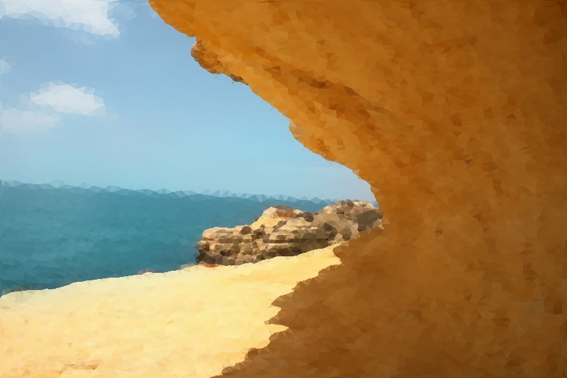
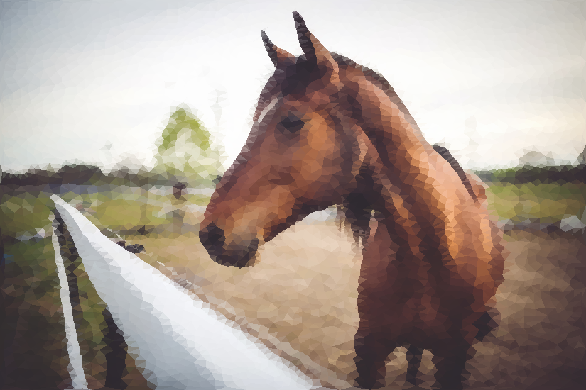
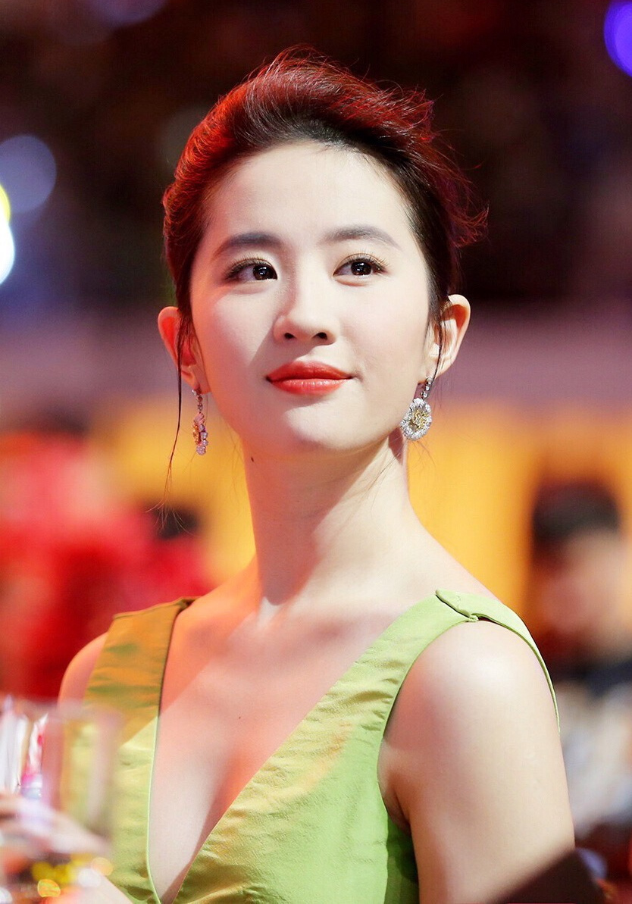
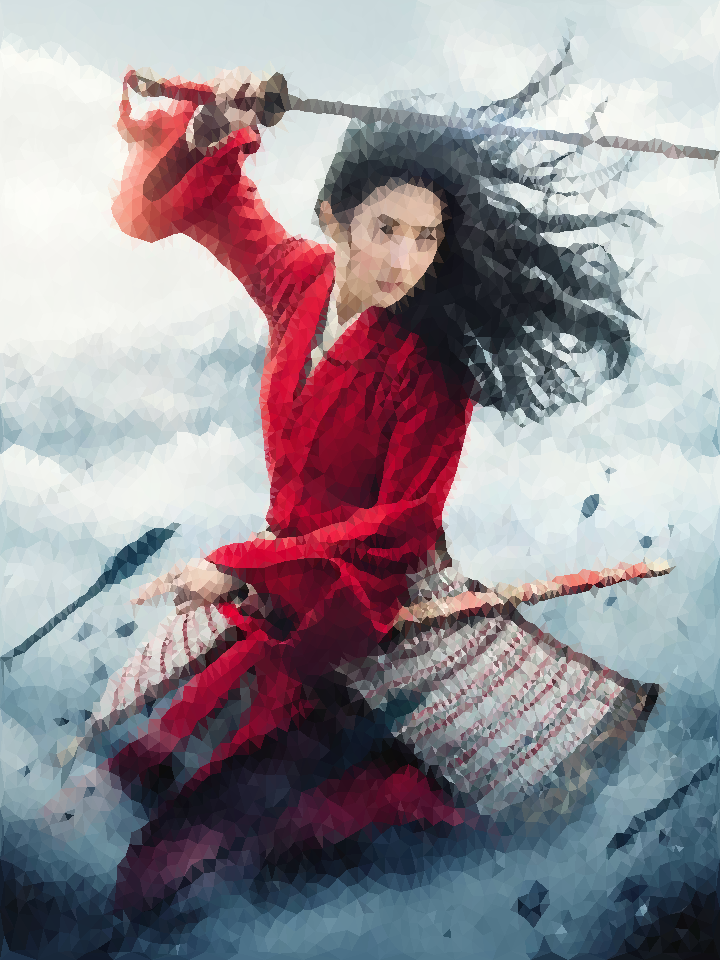

# CVTLowpoly: Image Lowpoly via Centroid Voronoi Diagram 

Image Sharp Feature Extraction using **Guide Filter**'s Local Linear Theory via opencv-python.

The Following two parts are bollowed from https://github.com/songshibo/JumpFlooding-taichi

2D/3D Voronoi tessellation using Jump Flooding algorithm(JFA). Adopt 1+JFA strategy to reduce errors.

2D Centroidal Voronoi Tessellation using Lloyd algorithm.


# Installation

The Python package can be installed with Pypi:

```shell
pip install CVTLowpoly
```
# Usage

```python
import cv2, CVTLowpoly
img = cv2.imread(filename, cv2.IMREAD_ANYCOLOR)

# case1: get triangle mesh
V, F, _sharp_image = CVTLowpoly.lowpoly_mesh(img)

# case2: get lowpoly image and triangle mesh
lowpoly_img, V, F, FColor = CVTLowpoly.lowpoly_image(img)
```

## Related Repo
[Image Stippling](https://github.com/xiconxi/ImageStippling)

[Semi-Isotropic Triangular Image Lowpoly](https://github.com/xiconxi/isotropic-lowpoly)


## Results

- Case 1: Source Image: 550x825(pixels: 453750), 1% sites

|              Source Image     |   CVTLowpoly(iters: 5, time: 1.7108s on Mac17-i5)   |
| :---------------------------: | :---------------------------: |
|  |  |

- Case 2: Source Image: 550x828(pixels: 455400), 1% sites

|              Source Image     |   CVTLowpoly(iters: 5, time: 2.0708s on Mac17-i5)   |
| :---------------------------: | :---------------------------: |
|  |  |

- Case 3: Source Image: 550x825(pixels: 453750), 1% sites

|              Source Image     |   CVTLowpoly(iters: 5, time: 0.7505s on Mac17-i5)   |
| :---------------------------: | :---------------------------: |
|  |  |

- Case 4: Source Image: 1193x834(pixels: 994962), 1% sites

|              Source Image     |   CVTLowpoly(iters: 5, time: 2.889s on Mac17-i5)   |
| :---------------------------: | :---------------------------: |
|  |  |

- Case 5: Source Image: 1193x834(pixels: 691200), 1% sites

|              Source Image     |   CVTLowpoly(iterations: 5, time: 2.763s on MacPro2017 i5)   |
| :---------------------------: | :---------------------------: |
|  |  |


# Reference

[Jump flooding in GPU with applications to Voronoi diagram and distance transform](http://citeseerx.ist.psu.edu/viewdoc/download?doi=10.1.1.101.8568&rep=rep1&type=pdf)

[GPU-Assisted Computation of Centroidal Voronoi Tessellation](https://personal.utdallas.edu/~xxg061000/GPU-CVT.pdf)

[Variants of Jump Flooding Algorithm for Computing Discrete Voronoi Diagrams](https://ieeexplore.ieee.org/stamp/stamp.jsp?tp=&arnumber=4276119)

[JumpFlooding-taichi](https://github.com/songshibo/JumpFlooding-taichi)

[Semi-Isotropic Triangular Image Lowpoly](https://github.com/xiconxi/isotropic-lowpoly)
